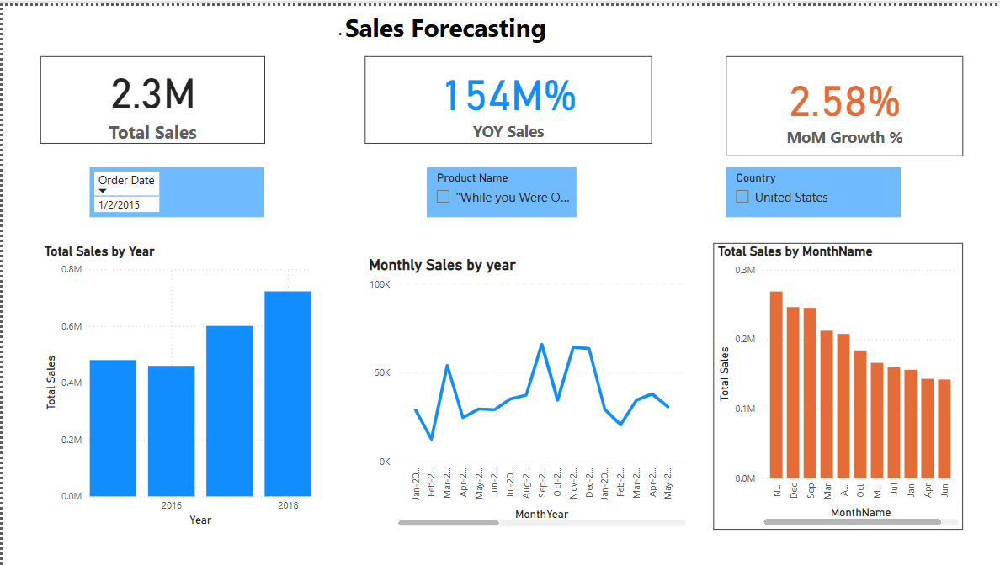
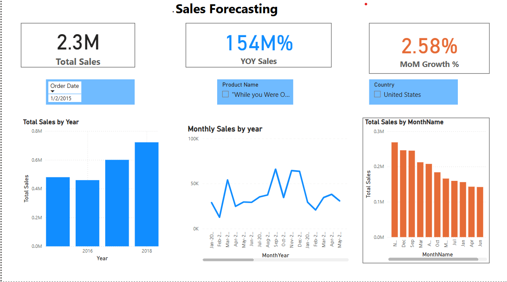

 

# 📈 Sales-Forecasting-Dashboard
## 📋 Project Overview
- I built a sales forecasting model using historical sales data to identify seasonal patterns and forecast future sales trends.
This dashboard helps business stakeholders make informed inventory, marketing, and staffing decisions based on predicted sales performance.

## 🛠️ Tools used
- **Excel** – Data cleaning and initial exploration

- **Power BI** – Data modeling, DAX measures, and visualization

## 🗂️ Dataset Information
- **Source** : https://www.kaggle.com/datasets/tanayatipre/store-sales-forecasting-dataset.

- **Records**: 9800 rows
- **Columns**: Order ID, Order Date, Ship Date, Shio Mode, Customer ID, Customer Name, Segment, Country, City, State, Postal Code, Region, Product ID, Category, Sub Category, Product Name, Sales, Year, and more.

## 📊 Key KPIS
- **Total Sales**: 2.3 Million
- **Year-over-Year**(YoY) Sales Growth: 2.58%
- **Total Sales by Year** : Tracked across different years
- **Monthly Sales by year**: Seasonal trends across years
- **Total Salss by Month**: Overall Monthly performance.

## ❓ Business Questions Answered

-  What are the monthly and seasonal trends in sales?

-  Which years showed the highest sales goal?

-  How does Month-over-Month performance vary?

-  Are there peak season for sales?

-  How fast is sales revenue growing year-over-year?

## 🖥️ Dashboard Preview

### Dashboard Overview

- **Cards** showing Total Sales, YOY sales, Growth, and MoM Growth %

### Trend Analysis

- **Total Sales by Year**:  Bar chart comparison

- **Monthly Sales by Year**: Line chart for seasonal patterns.

- **Total Sales by Month**: Bar chart of month-on-month totals.

## 🧠 Key Insights

- Sales peaked in November 2018, highlighting strong end-of-year demand and opportunities for seasonal promotions.
  
- 2018 recorded the highest overall sales compared to other years, suggesting a strong year for business growth.

- Month-over-Month (MoM) growth trends show clear seasonal surges and dips, useful for inventory planning and targeted marketing.

- Year-over-Year (YoY) growth was positive, indicating consistent business expansion.

- Monthly sales analysis reveals certain months underperform, offering opportunities for off-season marketing campaigns.

## 📌 Conclusion

The sales forecasting dashboard provides achionable insights that can help businesses optimize their inventory, improve sales stategies during peak seasons, and forecast future sales more accurately.

-----

Created by **Janetkomaiya**

## Connect with me

**[Linkendin profile]**: (https://www.linkedin.com/in/janet-komaiya-b4533a120?utm_source=share&utm_campaign=share_via&utm_content=profile&utm_medium=android_app)

**Email**| [www.gbemisolajanet@gmail.com]

  
